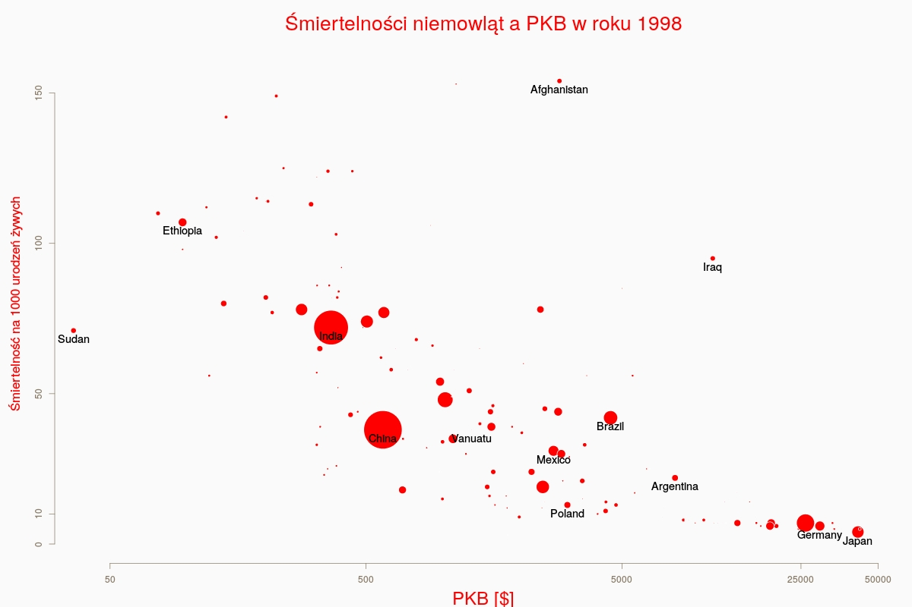

--- 
title       : Statystyka i rachunek prawdopodobieństwa
subtitle    : Pierwsze zajęcia
author      : Piotr Sobczyk
job         : PWr
logo        : pwr.jpg
biglogo     : znak_pwr.png
framework   : io2012        # {io2012, html5slides, shower, dzslides, ...}
highlighter : highlight.js  # {highlight.js, prettify, highlight}
hitheme     : zenburn      # 
widgets     : [bootstrap, quiz]            # {mathjax, quiz, bootstrap}
mode        : selfcontained # {standalone, draft}
knit        : slidify::knit2slides

--- .big-background-slide

## Kilka uwag 

* Program kursu dostępny jest na stronie [klik](http://im.pwr.edu.pl/documents/dydaktyka/karty/og/stacjonarne/pl/MAP3016.pdf)
* Moja strona: [im.pwr.edu.pl/~sobczyk](http://im.pwr.edu.pl/~sobczyk)
* Kontakt ze mną przez maila Piotr.Sobczyk[at]pwr.edu.pl -- proszę nie używać edukacji
* [Strona instytutu](http://www.im.pwr.edu.pl)

--- .background-slide &twocol

## Zasady zaliczania ćwiczeń


*** =left
| Liczba punktów | Ocena  |
| -------------  |:------:|
| <25            | 2      | 
| 25-30          | 3.0    |
| 30-35          | 3.5    |
| 35-40          | 4.0    |
| 40-45          | 4.5    |
| 45-50          | 5.0    |
| >50            | 5.5    |

*** =right

> 1. Dwa 45-minutowe kolokwia - każde po 25 punktów
> 2. Do tego można zdobyć do 10 punktów za aktywność
> 3. Od **3.5** zwolnienie z egzaminu

--- .big-background-slide

## Rzeczy do zapamiętania

> * Analiza danych jest niezbędna w pracy inżyniera
> * Pomaga zrozumieć świat **(http://www.gapminder.org/)**
> * Rachunek prawdopodobieństwa to język dla statystyki

--- .big-background-slide

## Co dzisiaj zrobimy?

> * Pokaz krótkiej analizy danych
> * Zaprezentowanie użyteczności języka R
> * Przerobimy kilka zadań z prawdopodobieństwa

--- .background-slide
## Przykładowa mini-analiza

```{r, echo=FALSE}
library(rCharts)
library(car)
data(UN)
```
Mamy rzeczywiste dane dotyczące 130 państw. 
Dane te zawierają dwa wskaźniki:

* Pierwszy to śmiertelność niemowlaków na 1000 urodzeń żywych.
* Drugi to PKB per capita w dolarach amerykańskich.
```{r, echo=FALSE}
head(UN)
```

---.big-background-slide
## Jakie pytania możemy zadać?

> 1. Jaki kraj jest najbogatszy?
> 2. Jaki kraj ma największą śmiertelność niemowląt?
> 2. Jaka jest średnia śmiertelność niemowląt?
> 3. Jak duże różni się PKB w różnych krajach?
> 4. Czy istnieją biedne kraje o niskiej śmiertelności niemowląt?
> 3. Czy istnieje związek pomiędzy śmiertelnością niemowląt a bogactwem kraju?

--- .background-slide
## Wizualizacja
Pierwszym elementem analizy danych powinna być wizualiazacja

```{r, echo=FALSE, warning=FALSE, error=FALSE, fig.align='center'}
plot(UN[,1]~UN[,2], xlab="PKB w $", ylab="śmiertelność dzieci na 1000 urodzen",
  main="Śmiertelność noworodków vs PKB na mieszkańca")
points(x=UN[150,2], y=UN[150,1], col="red", lwd=2, pch=23)
text(x=UN[150,2], y=UN[150,1],labels="Polska", col="red", pos=1, cex=2)
```

Niezbyt dobrze jeśli chodzi o Polskę...

--- .background-slide
## Na poprawę narodowego ego
```{r, echo=FALSE, warning=FALSE, fig.align='center'}
plot(UN[,1]~UN[,2], xlab="PKB w $", ylab="śmiertelność dzieci na 1000 urodzeń",
     main="Śmiertelność noworodków vs PKB na mieszkańca")
points(x=UN[150,2], y=UN[150,1], col="red", lwd=2, pch=23)
text(x=UN[150,2], y=UN[150,1],labels="Polska", col="red", pos=1, cex=2)
points(x=13393, y=5.8, col="green", lwd=2, pch=23)
text(x=13393, y=5.8, labels="Polska 2013", col="green", pos=1, cex=2)
```

Oczywiście reszta świata też poszła w tym czasie do przodu...

--- .big-background-slide
## Co dalej z naszą analizą?

> * Na podstawie wykresu przypuszczamy, że jest zależność
> * Czy jest ona istotna? [klik](http://www.tylervigen.com/)
> * To da się policzyć!

--- .big-background-slide

## Co dalej z naszą analizą?

> * Często stosowana metoda nazywa się regresją liniową.
> * Opisuje ona sytuację, w które
  zalezność pomiędzy zjawiskami, które próbujemy powiązać jest liniowa.
> * Nie pasuje to do naszych danych! Ale wytrenowany statystyk potrafi zrobić małe oszustwo...

--- .background-slide
## Rozważamy logarytmy z PKB per capita

```{r, echo=FALSE, warning=FALSE, fig.align='center'}
plot(UN[,1]~log(UN[,2]), xlab="logarytm z PKB [$]", ylab="śmiertelność dzieci na 1000 urodzeń",
     main="Śmiertelność noworodków vs PKB na mieszkańca")
```

--- .big-background-slide
Teraz liczymy regresję liniową (poznamy ją w trakcie semestru):
```{r, echo=FALSE}
lm.fit <- lm(UN[,1]~log(UN[,2]))
summary(lm.fit)
```
Gwiazdki wskazują na to, że zależność jest istotna!

--- .big-background-slide

Zobaczymy jak wyglądają nasze przewidywania (czerwona linia)

```{r, warning=FALSE, echo=FALSE, fig.align='center'}
plot(UN[,1]~log(UN[,2]), xlab="logarytm z PKB [$]", ylab="śmiertelność dzieci na 1000 urodzeń",
     main="Śmiertelność noworodków vs PKB na mieszkańca w roku 1998")
abline(lm.fit$coefficients, col="red")
```

--- .big-background-slide

## Możemy przewidywać śmiertelność w oparciu o PKB:
  
> * Jaka byłaby śmiertelność noworodków w Szkocji?
> * Korzystając z modelu liniowego podajemy nasze przewidywania i jest ono, miejmy nadzieję, bliskie prawdy
> * To metoda stosowana w praktyce!

--- .big-background-slide

## I teraz najważniejsze pytanie: 

> * Czy można powiedzieć, że wysokie PKB jest wpływa na śmiertelność noworodków?
> * <center>  </center>

--- .big-background-slide

## Dlaczego?

> * Nie musi być wynikania! Współzależność to nie wynikanie!
> * W godzinach szczytu rośnie liczba tramwajów i samochodów co nie oznacza, że obecność tramwajów przyciąga auta
> * Może istnieje inna, wspólna przyczyna obu tych zjawisk?
> * Np. kwestia klimatu (dżungla może sprzyjać chorobom)


--- &twocol

## Sprawdzamy nasze podejrzenia
Które państwa nie pasują do naszego modelu?
*** =left
Bogate kraje o wysokiej śmiertelności
```{r, echo=FALSE, fig.width=10}
UN2 <- UN[which(UN[,2]>10000),]
head(UN2[order(UN2[,1], decreasing=TRUE),])
```

*** =right
Biedne kraje o niskiej śmiertelności
```{r, echo=FALSE, fig.width=10}
UN3 <- UN[which(UN[,1]<35),]
head(UN3[order(UN3[,2], decreasing=FALSE),])
```

---



--- {
 tpl: thankyou, 
 social: [{title: GQU, href: "http://grupa-qu.pl/"},
  {title: R, href: "http://www.r-project.org/"}, 
  {title: Ja, href: "http://im.pwr.edu.pl/~sobczyk"}]
}

## Pytania?

Slajdy są dostępne na mojej stronie internetowej
